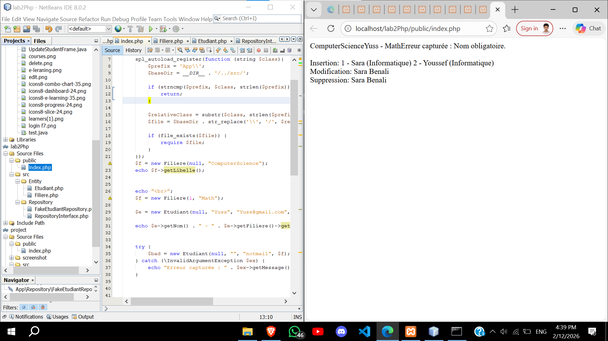

# Laboratoire PHP – Modèle Métier et Programmation Orientée Objet

---

### Objectifs

Ce laboratoire vise à construire un modèle métier simple en PHP 7 en appliquant les principes fondamentaux de la programmation orientée objet.  
À l’issue de ce travail pratique, il devient possible de concevoir des entités cohérentes, de structurer le code selon de bonnes pratiques et de simuler une couche d’accès aux données sans base de données.

---

### Fonctionnalités

- Définition de classes et instanciation d’objets  
- Encapsulation de l’état interne des objets  
- Utilisation de constructeurs cohérents  
- Mise en place de règles de validation dans les setters  
- Modélisation correcte d’une relation métier entre entités  
- Définition d’un contrat d’accès aux données via une interface Repository  
- Simulation d’un stockage en mémoire avec un FakeRepository  
- Organisation du code avec namespaces et une structure inspirée de PSR-4  
- Mise en place d’un autoload simple pour le chargement automatique des classes  

---

### Utilisation

Le laboratoire est structuré autour d’une organisation claire des fichiers, séparant les entités métier et la logique de persistance.  
Les différentes étapes permettent de tester progressivement l’autoload, la validité des entités et un scénario CRUD complet.  
L’exécution se fait via le terminal afin d’observer le comportement des objets et des opérations de création, lecture, modification et suppression.

---

### Résultats (Capture d’Écran)

